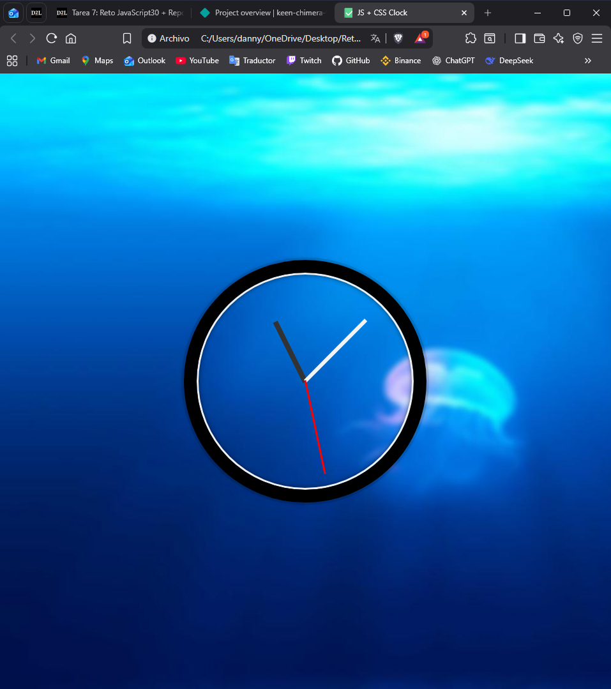

# ⏰ JS + CSS Clock - Reloj Analógico Interactivo

## 📋 Nombre del Reto

**JavaScript30 - Day 2: JS + CSS Clock**

## 🎯 Descripción

Este proyecto es un reloj analógico funcional y elegante que muestra la hora actual en tiempo real. Las manecillas del reloj se actualizan cada segundo utilizando JavaScript vanilla, con animaciones CSS suaves que simulan el movimiento de un reloj analógico tradicional. El objetivo del reto es practicar la manipulación del DOM, trabajar con fechas en JavaScript y crear animaciones CSS basadas en transformaciones.

## 🛠️ Tecnologías Utilizadas

![HTML5]
![CSS3]
![JavaScript]

- **HTML5** - Estructura del reloj
- **CSS3** - Estilos, animaciones y transformaciones
- **JavaScript (ES6+)** - Lógica para actualizar las manecillas en tiempo real

## ✨ Características

- ⏱️ **Actualización en tiempo real** - Las manecillas se mueven sincronizadas con la hora del sistema
- 🎨 **Diseño elegante** - Interfaz limpia con fondo degradado
- 🔄 **Animaciones fluidas** - Transiciones suaves con `cubic-bezier`
- 📐 **Manecillas diferenciadas**:
  - **Horas** (oscura, corta): 35% de longitud
  - **Minutos** (gris, mediana): 45% de longitud
  - **Segundos** (roja, larga): 50% de longitud
- 📱 **Responsive** - Se adapta a diferentes tamaños de pantalla

## 📸 Captura de Pantalla

<div align="center">
  


*El reloj actualiza las manecillas cada segundo mostrando la hora exacta*

</div>

## 🚀 Instalación y Ejecución Local

### Opción 1: Clonar el repositorio

```bash
# Clonar el repositorio
git clone https://github.com/Ptrickill/Reto-JS.git

# Entrar al directorio
cd Reto-JS

# Abrir el archivo index.html en tu navegador
start index.html  # Windows
open index.html   # macOS
xdg-open index.html  # Linux
```

### Opción 2: Descarga directa

1. Descarga el archivo `index.html`
2. Ábrelo en tu navegador favorito
3. ¡Listo! No se requieren dependencias ni instalaciones adicionales

## 🌐 Despliegue

Este proyecto está desplegado y disponible públicamente en:

### 🔗 **[https://keen-chimera-9ef780.netlify.app/]**

Desplegado con **Netlify** - Actualización automática con cada push a `main`

## 📝 Código Destacado

### Función principal para actualizar el reloj

```javascript
function setDate() {
  const now = new Date();

  // Manecilla de segundos
  const seconds = now.getSeconds();
  const secondsDegrees = ((seconds / 60) * 360) + 90;
  secondHand.style.transform = `rotate(${secondsDegrees}deg)`;

  // Manecilla de minutos
  const mins = now.getMinutes();
  const minsDegrees = ((mins / 60) * 360) + ((seconds/60)*6) + 90;
  minsHand.style.transform = `rotate(${minsDegrees}deg)`;

  // Manecilla de horas
  const hour = now.getHours();
  const hourDegrees = ((hour / 12) * 360) + ((mins/60)*30) + 90;
  hourHand.style.transform = `rotate(${hourDegrees}deg)`;
}

setInterval(setDate, 1000);
```

## 🎨 Personalización

Puedes personalizar el reloj modificando las variables CSS:

- **Colores de las manecillas**: `.hour-hand`, `.min-hand`, `.second-hand`
- **Tamaño del reloj**: `.clock` → `width` y `height`
- **Velocidad de animación**: `.hand` → `transition`
- **Imagen de fondo**: `html` → `background`

## 👨‍💻 Autor

**Daniel Díaz**

- GitHub: [@Ptrickill](https://github.com/Ptrickill)
- Proyecto: [Reto-JS](https://github.com/Ptrickill/Reto-JS)

---

